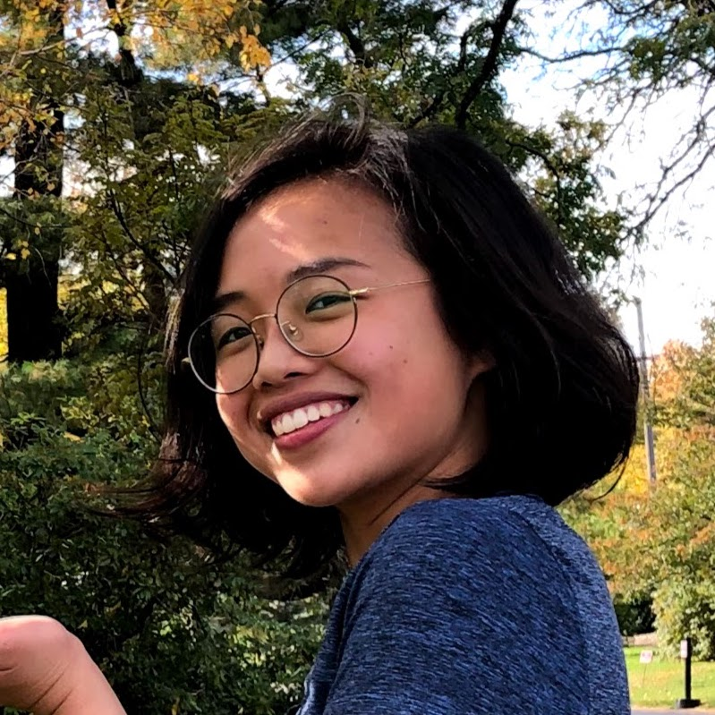

<!--  -->
## About Me

I am a junior at Harvard studying Statistics. I'm broadly interested in data science and statistics applied to areas such as public health, public policy, psychology, and finance. I have previously worked in data science or data-related intern roles at Facebook, [Datavant](https://datavant.com/), and <a href = "https://secureailabs.com/" target = "_blank">Secure AI Labs</a>.  
  
Check out the "Works and Projects" tab for more details on my work and past projects. Contact me at [alyssachen@college.harvard.edu](mailto:alyssachen@college.harvard.edu) to talk about my work or anything else---data, social impact, healthcare, philosophy, music, etc. 

<!-- ## Typography

steam: https://iop.harvard.edu/get-involved/steam
the opportunity project: https://opportunity.census.gov/sprints/

This is a [link](http://google.com). Something *italics* and something **bold**.

Here is a table

Year | Award | Category
-----|-------|--------
2014 | Emmy  | Won Outstanding Lead Actor in a miniseries or a movie
2015 | BAFTA | Nominated for Best Leading Actor for Sherlock
2014 | Satellite | Won Best Actor miniseries or television film

Here is a horizontal rule

---

Here is a blockquote

> To a great mind, nothing is little

## References

* Foo Bar: Head of Department, Placeholder Names, Lorem
* John Doe: Associate Professor, Department of Computer Science, Ipsum

-->
