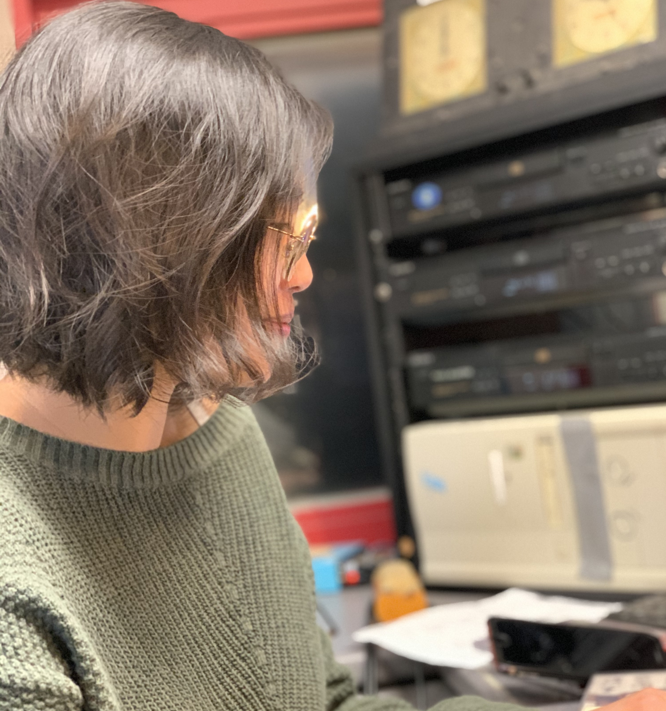

## About Me

Hi! I am a student at Harvard studying applied math and computer science. This website is a work-in-progress. Testing! 

## Education
### Harvard University, May 2022

#### Selected Coursework 
Machine Learning (@MIT), Data Structures and Algorithms, Biological and Artificial Intelligence, Economics of Networks, Fairness and Validity in Algorithms (graduate), Group Theory, Probability, Statistical Inference, Theoretical Linear Algebra, Real Analysis, Public Speaking Practicum, Physics: Mechanics and Special Relativity

## Work Experience

### Secure AI Labs (SAIL) | Cambridge, MA / remote | May 2020 - August 2020
* Developed and tested an accuracy-preserving federated version of XGBoost for SAIL’s secure computing platform.
* Researched methods for developing differentially private versions of common algorithms.

## Projects

* C. Yeo, A. Chen: “Defining and Evaluating Fair Natural Language Generation.” *Proceedings of the The Fourth Widening Natural Language Processing Workshop at ACL 2020.*

<!-- ## Typography

This is a [link](http://google.com). Something *italics* and something **bold**.

Here is a table

Year | Award | Category
-----|-------|--------
2014 | Emmy  | Won Outstanding Lead Actor in a miniseries or a movie
2015 | BAFTA | Nominated for Best Leading Actor for Sherlock
2014 | Satellite | Won Best Actor miniseries or television film

Here is a horizontal rule

---

Here is a blockquote

> To a great mind, nothing is little

## References

* Foo Bar: Head of Department, Placeholder Names, Lorem
* John Doe: Associate Professor, Department of Computer Science, Ipsum

-->
